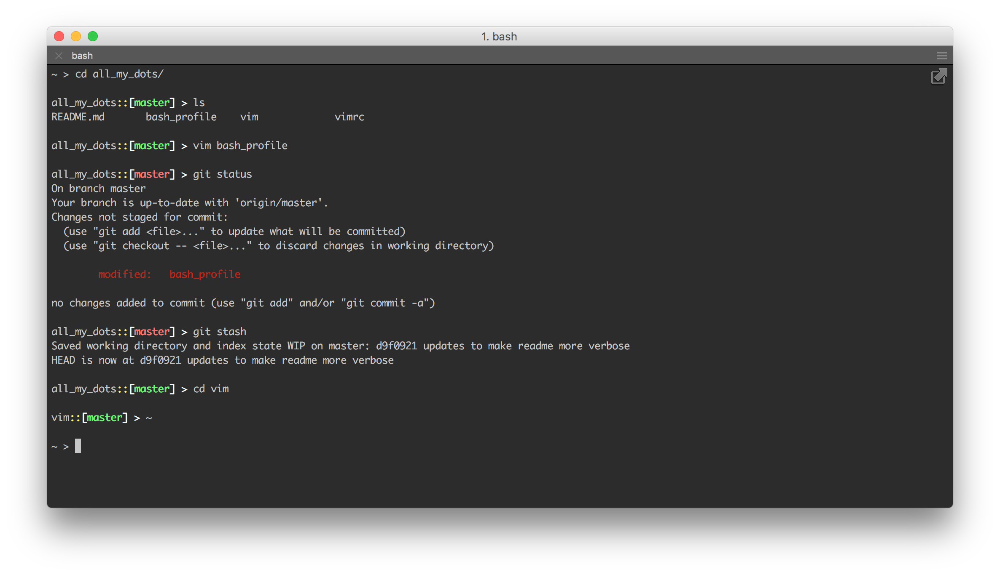

To use this just run:
```
git clone git@gitlab.com:reecebisel/all_my_dots.git 
```
Then create symlinks for your `bash_profile` && `vimrc` using:
```
ln -s path/to/all_my_dots/vimrc ~/.vimrc
ln -s path/to/all_my_dots/bash_profile ~/.bash_profile
```
Finally run: 
```
echo source ~/.bash_profile > ~/.bashrc
```

Here is a quick view of what my bash profile looks like. 

